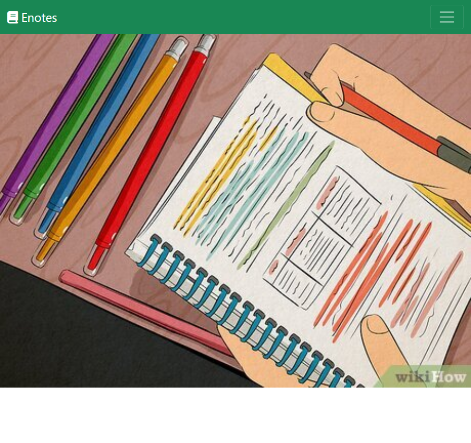
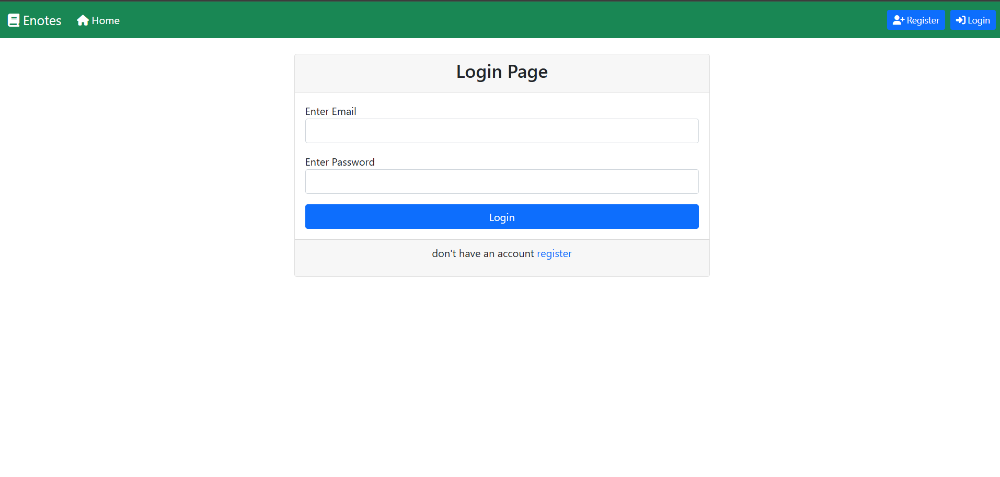
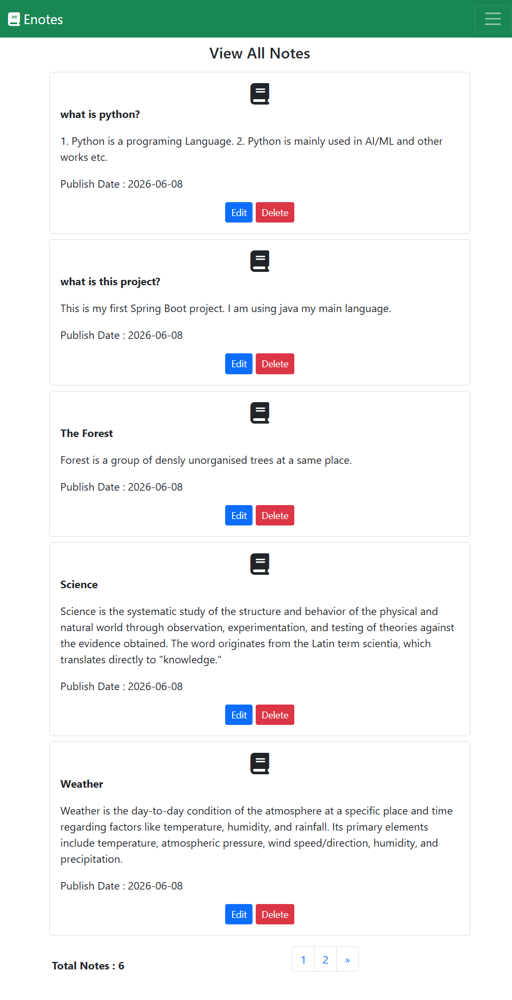
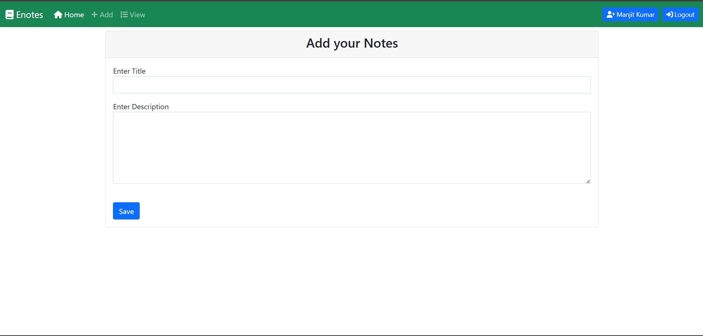
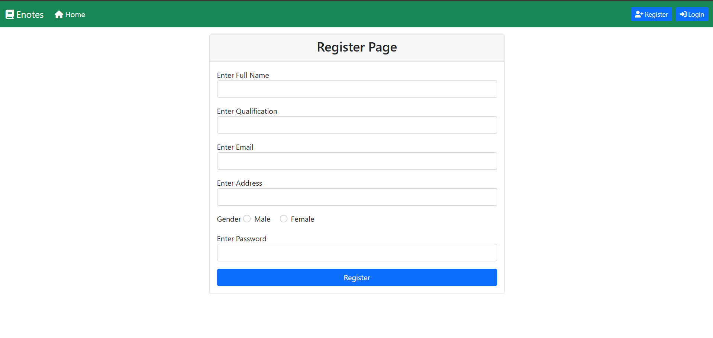

# 📝 E-Notes Spring Boot Project

A secure note management web application built using **Spring Boot**, **Spring Security**, **Thymeleaf**, and **MySQL**. Users can register, log in, and manage their personal notes efficiently.

---

## 🚀 Features

- 👤 User Registration and Login
- 🔐 Authentication & Authorization using Spring Security
- 📝 Create New Notes
- ✏️ Edit Existing Notes
- 🗑️ Delete Notes
- 📋 View All Notes
- 🎨 Responsive UI with Bootstrap
- 💾 Data Persistence using MySQL
- ⚡ Maven-based Spring Boot project

---

## 🛠️ Tech Stack

| Technology | Description |
|------------|-------------|
| Java 21 | Programming Language |
| Spring Boot | Backend Framework |
| Spring Security | Authentication & Authorization |
| Spring Data JPA | Database Operations |
| Hibernate | ORM Framework |
| Thymeleaf | Server-side Templating Engine |
| MySQL | Relational Database |
| Bootstrap | Frontend Styling |
| Maven | Dependency Management |

---

## 📂 Project Structure

```
src
├── main
│   ├── java
│   │   └── com.prog
│   │       ├── config
│   │       ├── controller
│   │       ├── entity
│   │       ├── repository
│   │       └── service
│   └── resources
│       ├── static
│       ├── templates
│       └── application.properties
└── test
```

---

## ⚙️ Prerequisites

Before running this project, ensure you have the following installed:

- Java 21 or later
- Maven
- MySQL Server
- STS / Eclipse / IntelliJ IDEA

---

## 🗄️ Database Configuration

Update the `application.properties` file with your MySQL credentials:

```properties
spring.datasource.url=jdbc:mysql://localhost:3306/enotes_db
spring.datasource.username=YOUR_USERNAME
spring.datasource.password=YOUR_PASSWORD

spring.jpa.hibernate.ddl-auto=update
spring.jpa.show-sql=true
```

Create a database named:

```sql
CREATE DATABASE enotes_db;
```

---

## ▶️ Running the Application

### Clone the repository

```bash
git clone https://github.com/Manjit-Kumar-Mahato/Enotes-spring-boot-project.git
```

### Navigate to the project directory

```bash
cd Enotes-spring-boot-project
```

### Run using Maven

```bash
mvn spring-boot:run
```

Or run the `EnotesSpringBootProjectApplication.java` file directly from your IDE.

---

## 🌐 Access the Application

After starting the application, open:

```
http://localhost:8080
```

---

## 📸 Screenshots

> Add screenshots of your application here.

### Home Page



### Login Page



### Notes Dashboard



### Add Notes



### Register Page



---

## 📚 Learning Outcomes

Through this project, I gained hands-on experience with:

- Spring Boot application development
- Implementing Spring Security
- Working with Thymeleaf templates
- Using Spring Data JPA and Hibernate
- Managing relational databases with MySQL
- Applying MVC architecture
- Version control using Git and GitHub

---

## 🤝 Contributing

Contributions, issues, and feature requests are welcome.

Feel free to fork this repository and submit a pull request.

---

## 👨‍💻 Author

**Manjit Kumar Mahato**

- GitHub: https://github.com/Manjit-Kumar-Mahato
- LinkedIn: https://www.linkedin.com/in/manjit-mahato-a92578338/

---

## ⭐ Support

If you found this project helpful, please consider giving it a **star ⭐** on GitHub.
